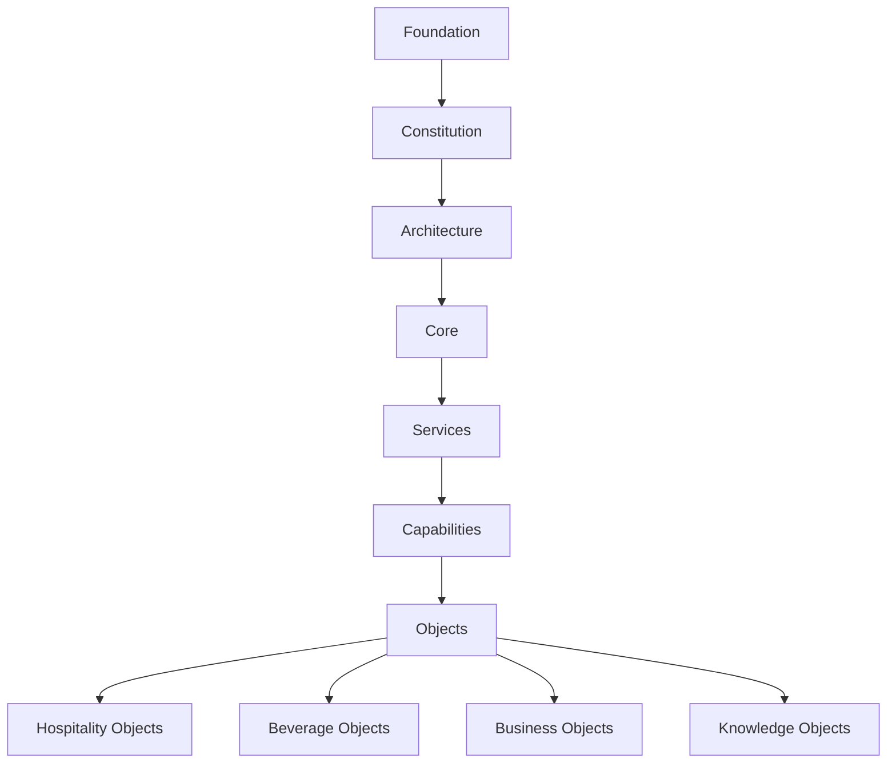

# 1210 MethodOS™

**Enterprise Domain Specification for Hospitality Engineering, Consulting, Knowledge Architecture and AI-native Operations.**

1210 MethodOS™ ist das Referenzsystem für Department 66, StiegerConsult, CaaS, D66 Academy, Cocktail-Analyst und den Forensischen Barkeeper™.

---

## Systemübersicht

---

## Releases

| Release | Bereich | Status |
|---|---|---|
| 0.1 | Foundation | abgeschlossen |
| 0.2 | Constitution | abgeschlossen |
| 0.3 | Architecture | abgeschlossen |
| 0.4 | Core | abgeschlossen |
| 0.5 | Services | abgeschlossen |
| 0.6 | Capabilities | abgeschlossen |
| 0.7 | Core Objects | abgeschlossen |
| 0.8 | Hospitality Objects | abgeschlossen |
| 0.9 | Beverage Objects | abgeschlossen |
| 1.0 | Business Objects | abgeschlossen |
| 1.1 | Knowledge Objects | abgeschlossen |

---

## Hauptdomänen

### Hospitality Engineering

MethodOS modelliert Hospitality als beobachtbares, messbares und kontinuierlich verbesserbares System.

### Knowledge Architecture

Alle Inhalte sind versioniert, referenzierbar und für Menschen sowie KI nutzbar.

### AI-native Operations

Dokumentation, Ontologie, Knowledge Graph, RAG, MCP und Agenten werden als zusammenhängendes System gedacht.

---

## Nächste Ausbaustufe

1. Vollständige JSON-Schemas für alle Objekte
2. SQL-DDL für Datenbankmodelle
3. OpenAPI / GraphQL
4. Knowledge Graph
5. RAG- und MCP-Struktur
6. AI-Agenten für Recherche, Audit, Operations und Consulting
